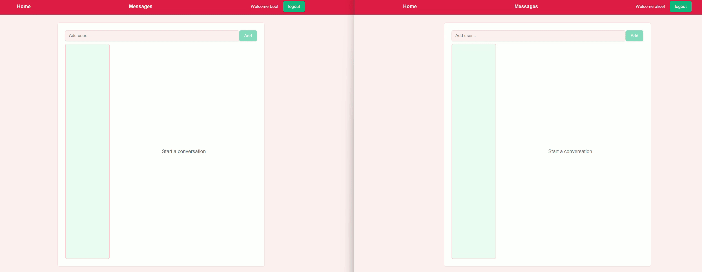
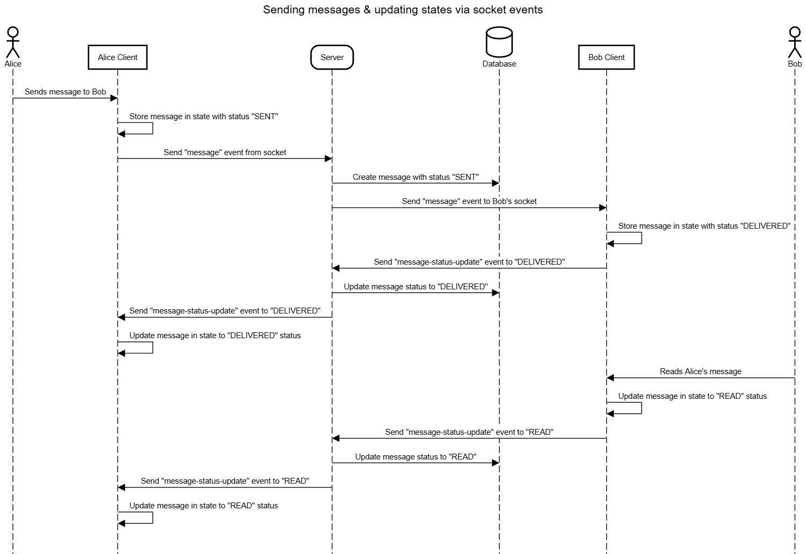
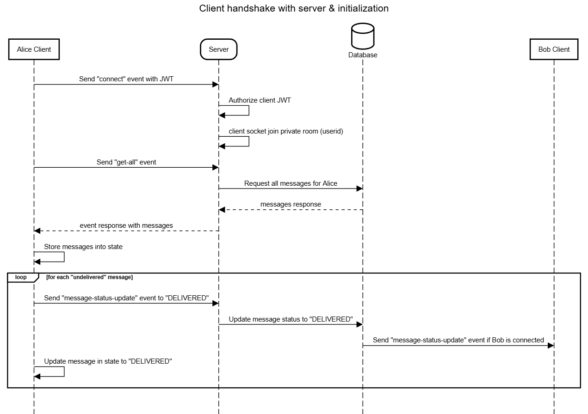

# Wazz App

Wazz App is a user-to-user chat messaging application built with the following technology.

* **React** - Frontend
* **NestJS** - Backend 
* **MongoDB** - Persisting messages in a database 
* **Socket.IO** - Websocket for exchanging messages and state updates with the client and server

## Key Features

* **Message Status** Track whether the messages have been delivered or read with the statuses `sent`, `delivered` & `read`.

* **User Authentication** Uses JWT Authentication to authenticate users on the application.

* **Guarateed Message Delivery** Ensures messages will be delivered to the recipient user even if they are offline when messages are sent. They will receive the message once they return online.



## How to run

### Run with Docker

* Navigate to the root folder (containing the docker-compose.yml file)
* Run the command

```
docker-compose up
```

* Client url will be: http://localhost:8080/

## Documentation

### Application Use Cases



*Fig 1: Flow of events for sending messages and message state updates between users.*



*Fig 2: Initializing client websocket handshake with server and retrieving message data.*
